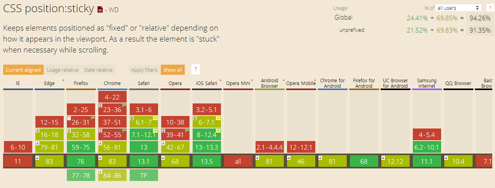
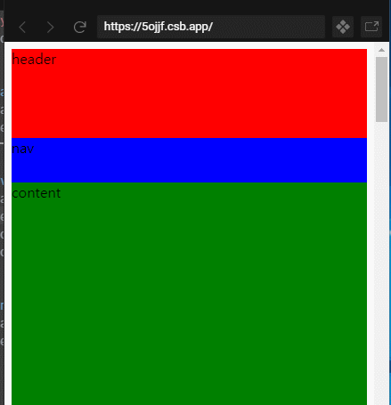

## { position: sticky; }

position sticky 속성을 사용하면 스크롤의 위치가 임계점에 다다르면 position fixed와 같이 화면에 고정된다.

## caniuse?



대부분의 브라우저에 지원되지만, IE, Opera Mini 등에는 지원하지 않는다.

## Usage

```html
<body>
  <div id="header">header</div>
  <div id="nav">nav</div>
  <div id="content">content</div>

  <script src="src/index.js"></script>
</body>
```

HTML 코드

```css
#header {
  background: red;
  height: 100px;
}

#nav {
  background: blue;
  height: 50px;
  position: sticky;
  top: 0;
}

#content {
  background: green;
  height: 1000vh;
}
```

CSS 코드

nav의 position을 sticky로 지정 후 top 속성을 0으로 주어 스크롤바가 내려가면 따라오게 하였다.



[View Code](https://codesandbox.io/s/sticky-5ojjf)
