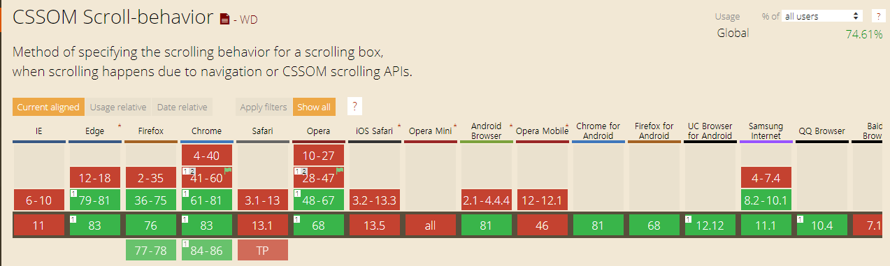

## { scroll-behavior: smooth; }

scroll-behavior: smooth 속성을 html 전역에 사용하면 a href로 이동되는 스크롤의 움직임이 부드러워진다.

## caniuse?



IE, Safari 등등에서 지원되지 않는다.

## Usage

```html
<div id="box1" class="box1">
  <a href="#box2">
    <h2>test1</h2>
  </a>
</div>
<div id="box2" class="box2">
  <a href="#box1">
    <h2>test2</h2>
  </a>
</div>
```

HTML 코드

```css
body {
  font-family: sans-serif;
}

html {
  scroll-behavior: smooth;
}

#box1 {
  height: 600px;
  background-color: red;
  height: 100vh;
}

#box2 {
  height: 600px;
  background-color: white;
  height: 100vh;
}
```

CSS 코드

scroll-behavior를 smooth로 주어 하이퍼링크를 클릭하면 스크롤이 부드럽게 움직이게 한다.

[View Code](https://codesandbox.io/s/scroll-behavior-smooth-onquc)
